## 문제점

1. 페이지네이션이 느립니다.
2. 똑같은 API를 계속 호출합니다.
3. 드래그/드롭으로 개체를 옮길 수 있지만 무척 느립니다.
4. 시간표가 많아질수록 렌더링이 기하급수적으로 느려집니다.

## API 호출 개선

### (1) `Promise.all` 개선

> 병렬로 실행될 것 같지만 실제로 직렬로 실행되고 있다

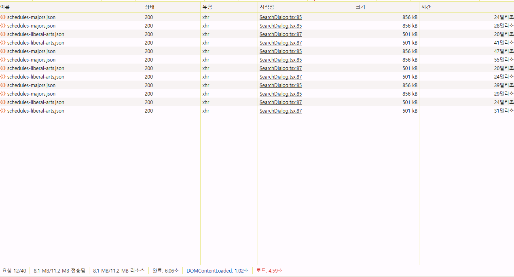
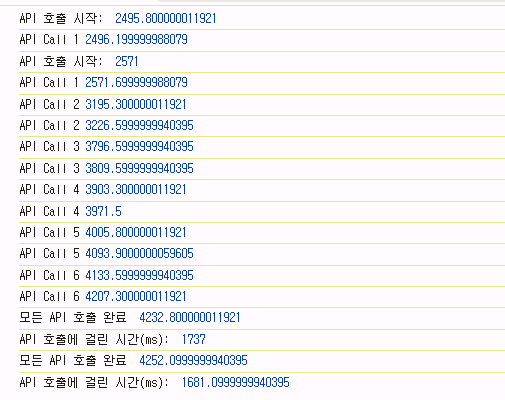

- `await` 키워드 삭제하여 병렬처리

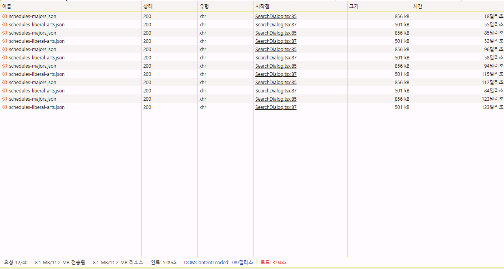
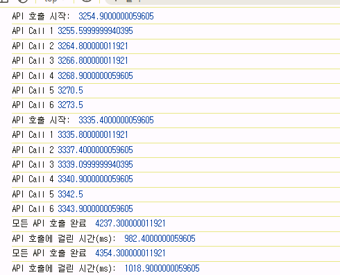

### (2) API 중복 호출 개선

> 동일한 API가 중복되어서 실행되고 있다.

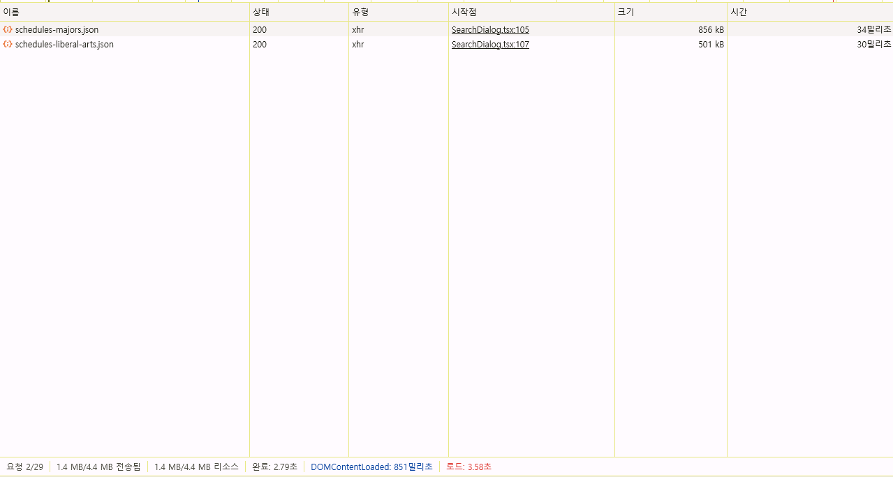
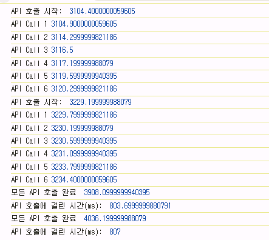

- API 캐싱하여 중복 호출 개선(6개 호출 ->2개 호출)
- 200ms 개선

## React 메모이제이션

### (1) useMemo/useCallback 사용하여 값 메모이제이션

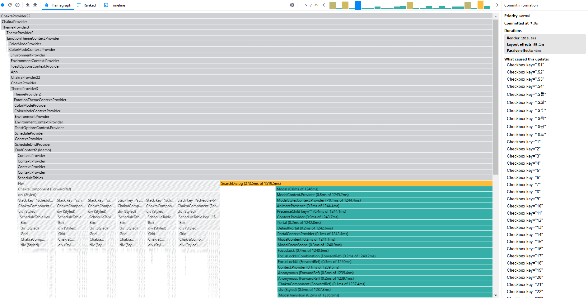
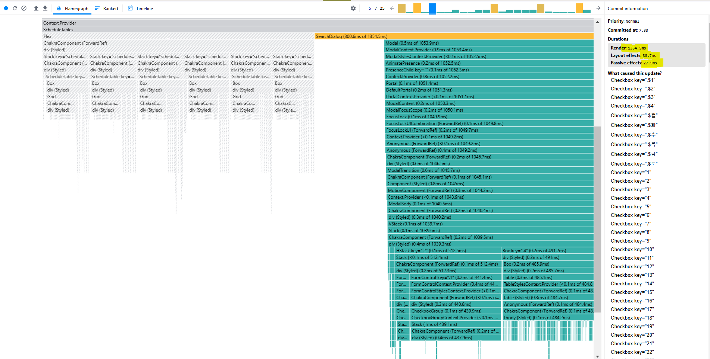

- Render: 1519.5ms -> 1354.5ms
- Layout Effect: 95.1ms -> 80.7ms
- Passive Effect: 43ms -> 27.9ms
- 불필요한 연산 최적화

### (2) React.Memo 사용하여 Component 메모이제이션

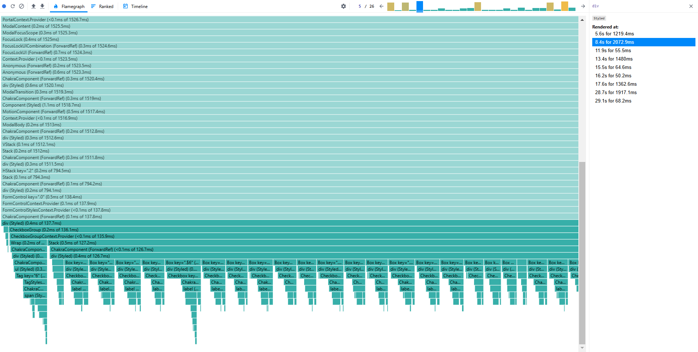
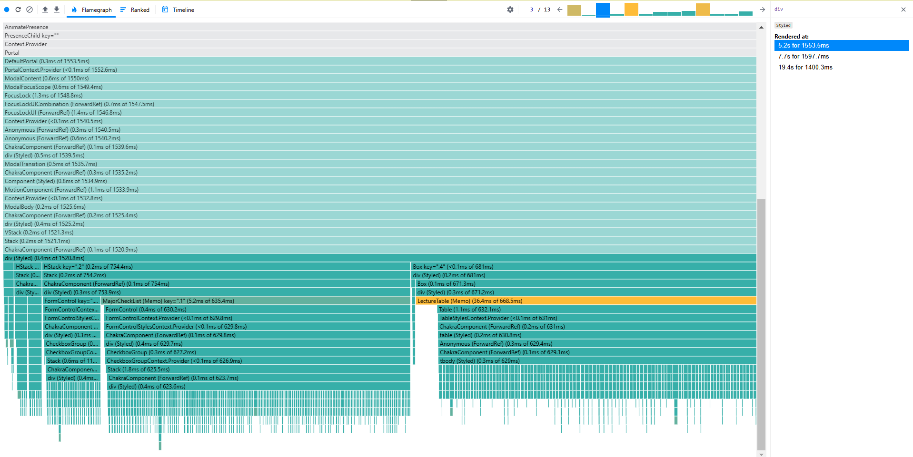

- 불필요한 리렌더링 최적화

## DnD 최적화

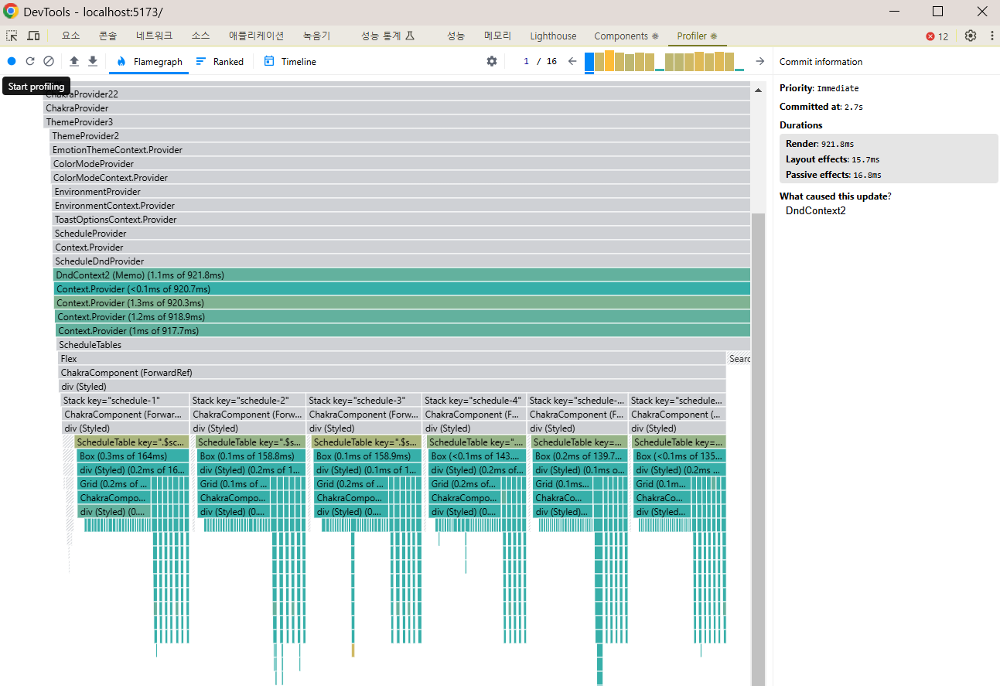
