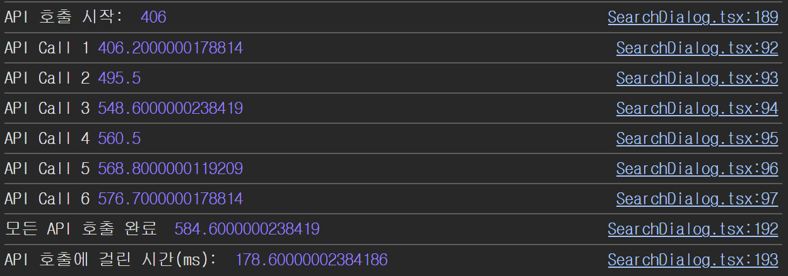

# 마지막 과제 - 성능 최적화 보고서

## 1. API 콜 최적화

1️⃣ 개선 전

2️⃣ 개선 후

| 구분    | 평균 소요 시간 | 최소 시간 | 최대 시간  | 성능 개선율  |
| ------- | -------------- | --------- | ---------- | ------------ |
| 개선 전 | 207.9ms        | 178.6ms   | 243.8ms    | -            |
| 개선 후 | 97.24ms        | 80.1ms    | 114.1ms    | **53.2%** ⬇️ |

### 상세 측정 결과

#### 개선 전 호출 시간 (ms)

| 시도  |  1     | 2     | 3     | 4     | 5     |  6     | 7     | 8     | 9     | 10    |
| ----- | ------ | ----- | ----- | ----- | ----- | ------ | ----- | ----- | ----- | ----- |
|  시간 | 178.6  | 212.3 | 243.8 | 205.5 | 227.0 | 195.1  | 212.8 | 187.6 | 195.1 | 221.2 |

#### 개선 후 호출 시간 (ms)

| 시도  | 1    | 2     | 3     | 4     |  5    | 6      | 7    | 8    | 9     | 10   |
| ----- | ---- | ----- | ----- | ----- | ----- | ------ | ---- | ---- | ----- | ---- |
|  시간 | 80.1 | 98.5  | 103.3 | 112.0 | 100.6 |  100.1 | 81.6 | 85.9 | 114.1 | 96.2 |

> [!NOTE]  
> 클로저를 이용한 캐시 구현으로 API 호출 시간이 평균 53.2% 감소했습니다.

---

## 2. Drag 렌더링 최적화

- `ScheduleTable` 내의 `useContext` 대신 `useDndMonitor` 모니터를 사용하여 특정 스케쥴 테이블에서 drag시 해당 컴포넌트만 리렌더링 되도록 개선

1️⃣ 개선 전

2️⃣ 개선 후

3️⃣ 추가 개선
  - `onDragStart, onDragEnd` 시에 `drag` 중인 `table`이 아니면 리렌더링이 안일어나도록 추가
  
  
  - 실제 `drag` 했을 때
  

## Highlight로 바라보는 렌더링 개선 결과
  https://github.com/user-attachments/assets/e0c3ad78-1ec9-4b2e-844d-d42923152f2f

